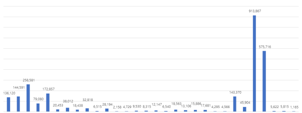

# FRCNN_trademark_similarity
*this is not being maintained now*
Using Faster RCNN and Mask RCNN, Implemented Multilabel classification and Image similarity.

Implemented by Custom trademark dataset & custom class for training

## Multi label classification
One of difficult trademark's feature is that it is figurative. It could be expressed like "the heart shaping cat", "the S shaping chicken", etc

And trademarks are classificated by ViennaCodes, but It couldn't explain the all image appearance.
So we need to make new classification table based on ViennaCodes.
We tried to contain the all feature but some are removed due to accuracy.
For example, the trademarks' viennacodes distribution is not flat because many trademark contain a Creature
</img>

 </img>
</img>
</img> 

## Image Similarity
