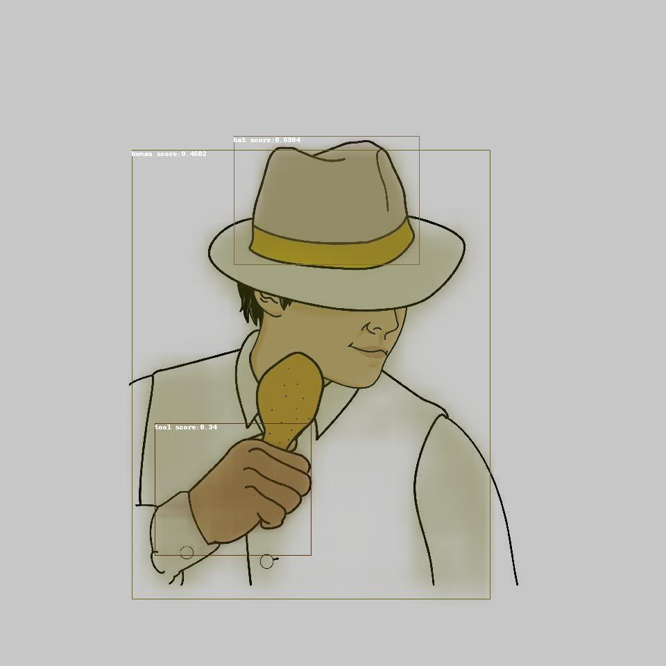
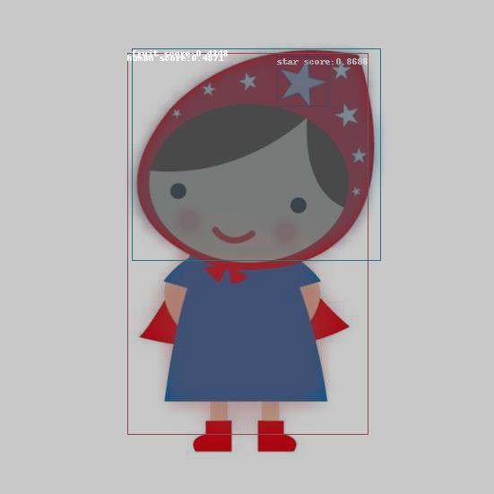
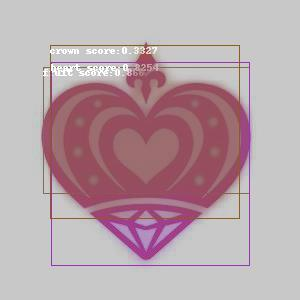

# FRCNN_trademark_similarity
*this is not being maintained now*
Using Faster RCNN and Mask RCNN, Implemented Multilabel classification and Image similarity.

Used Custom trademark dataset & custom class for training

### Multi label classification

</img> 
